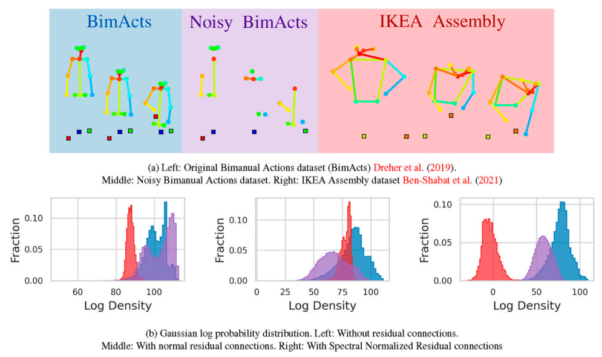
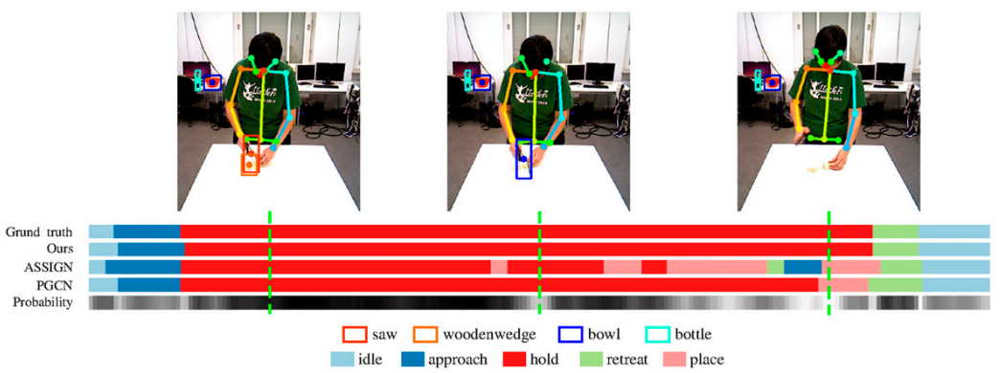

# UQ-TFGCN: Understanding Human Activity with Uncertainty Measure for Novelty in Graph Convolutional Networks

This repository contains the official implementation for our paper "Understanding Human Activity with Uncertainty Measure for Novelty in Graph Convolutional Networks" (submitted to [The International Journal of Robotics Research]). We propose a novel approach for human activity recognition with uncertainty quantification using Graph Convolutional Networks (GCNs), evaluated on the Bimanual Actions and IKEA ASM datasets.

## 📌 Overview
 
- Novel architecture combining GCNs with uncertainty quantification
- Experimental evaluation on two challenging datasets:
  - **Bimanual Actions Dataset**
  - **IKEA ASM Dataset**
- Comprehensive analysis of novelty detection in human activities
- Quantitative evaluation of uncertainty measures

## 📥 Dataset Preparation

### Required Datasets
1. **Bimanual Actions Dataset**  
   Download from: [Bimanual Actions Dataset Website](https://bimanualactionsdataset.github.io/)  
   Please cite:
   @inproceedings{mateusz2018bimanual,
      title={Bimanual Actions Dataset},
      author={Mateusz, S. and colleagues},
      booktitle={IEEE Conference on Computer Vision and Pattern Recognition},
      year={2018}
    }

2. **IKEA ASM Dataset**  
Download from: [IKEA ASM Dataset Website](https://ikeaasm.github.io/)  
Please cite:
  @inproceedings{ikeaasm2020,
    title={IKEA ASM Dataset},
    author={Damen, D. and colleagues},
    booktitle={European Conference on Computer Vision},
    year={2020}

  }
  

## 📊 Preliminary Results

### Datasets

### OOD Detection Performance Metrics
| Methods          | AUROC^1 | AUPRC^1 | AUROC^2 | AUPRC^2 |
|------------------|---------|---------|---------|---------|
| MC-dropout | 99.95 ± 0.02 | 99.89 ± 0.02 | 78.00 ± 0.09 | 81.38 ± 0.08 |
| Ensemble | 99.81 ± 0.22 | 99.68 ± 0.33 | 86.29 ± 2.61 | 88.76 ± 2.17 |
| DUQ | 83.58 ± 3.98 | 80.96 ± 5.56 | 52.86 ± 7.43 | 57.00 ± 8.98 |
| SNGP        | 93.16 ± 3.44 | 84.67 ± 7.91 | 79.17 ± 1.89 | 78.03 ± 1.55 |
| **UQ-TFGCN** | 99.39 ± 0.97 | 99.13 ± 1.00 | 90.19 ± 0.92 | 92.07 ± 0.93 |

**Notes** 
- ^1 IKEA ASM is OOD
- ^2 Noisy Bimacs is OOD

### Visualization
#### Activity Recognition Samples and Uncertainty Gray Scale
 

## 🛠 Installation & Usage
*Code will be released soon.*
